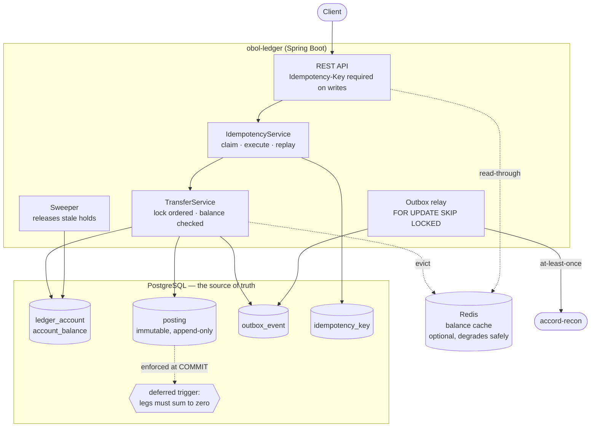

# obol-ledger

A double-entry ledger and settlement engine, in Java and Spring Boot.

Not a CRUD service with a `balance` column. Money is recorded the way an
accountant would record it — as balanced journal entries that are never edited
— and the rule that keeps it correct is enforced by PostgreSQL, not by the
application. An unbalanced transfer cannot be committed to this database even
by someone with a `psql` prompt and no interest in the Java code.

---

## The problem this is built around

Anyone can hold a balance in a column and add to it. The interesting part of a
payments system is everything that goes wrong around that:

- The client's HTTP call times out. It cannot tell whether the payment
  happened. **It retries.**
- Two transfers touching the same two accounts arrive at the same instant,
  in opposite directions.
- A card is authorised for £30 today and captured for £30 tomorrow — and the
  money must be unavailable in between without having moved.
- A downstream service needs to know about every posting, exactly once, and
  the ledger must not be able to commit money without also announcing it.
- Six months later, someone asks whether the balances are still right.

This service answers all five, and the tests demonstrate each one rather than
asserting it in prose.

---

## Guarantees, and where each one actually lives

| Guarantee | Enforced by | Proven by |
|---|---|---|
| Every transfer's legs sum to zero, per currency | Deferred constraint trigger in Postgres | `ConcurrentTransferTest#theDatabaseItselfRejectsAnUnbalancedTransfer` — raw SQL, service bypassed |
| Postings are never updated or deleted | `BEFORE UPDATE OR DELETE` trigger that always raises | Same file; corrections are reversing entries |
| A retried request pays once | `INSERT … ON CONFLICT DO NOTHING` on the idempotency key | `IdempotencyConcurrencyTest` — 20 threads released from one barrier |
| Concurrent transfers cannot deadlock | Account rows locked in sorted id order | `ConcurrentTransferTest` — 400 transfers, 16 threads, contended pairs in both directions |
| No account is overdrawn under a race | `SELECT … FOR UPDATE` before the funds check | Same test; refusals are counted, not just tolerated |
| A pending hold reserves funds without moving them | Separate `transfer_leg` (intent) and `posting` (record) tables | `PendingExpiryTest` |
| A stale hold is released | Sweeper on an injected `Clock` | `PendingExpiryTest`, by moving time rather than sleeping |
| Events cannot be lost relative to the ledger | Transactional outbox written in the same transaction | Backlog reported by `/v1/admin/verify` |
| The balances still match the journal | Recompute-and-compare over all postings | Asserted after every concurrency test |

---

## How it fits together



The companion service, [accord-recon](https://github.com/ankush2001/accord-recon),
consumes those posting events and reconciles them against external bank
statements — the other half of how money is actually verified in practice.

---

## Run it

Requires Docker and JDK 17.

```bash
docker compose up -d          # Postgres + Redis
mvn spring-boot:run           # Flyway migrates on startup

./scripts/demo.sh             # walks every feature, 25 assertions
```

`docs` at <http://localhost:8080/docs> · OpenAPI at `/v3/api-docs` ·
metrics at `/actuator/prometheus`.

> The dev stack binds Postgres to **55432** and Redis to **56379**, not their
> defaults. A machine with a system PostgreSQL already on 5432 otherwise wins
> the race silently, and the symptom — `password authentication failed` — sends
> you looking in entirely the wrong place.

---

## The API in one example

A payment that splits out a fee is **one** transfer with three legs, not two
transfers that can half-fail:

```bash
curl -X POST localhost:8080/v1/transfers \
  -H 'Content-Type: application/json' \
  -H 'Idempotency-Key: 5f2c9a1e-...' \
  -d '{
    "currency": "USD",
    "externalId": "psp_ch_9f2a41",
    "legs": [
      {"accountCode": "wallet:alice", "direction": "DEBIT",  "amountMinor": 2000},
      {"accountCode": "wallet:bob",   "direction": "CREDIT", "amountMinor": 1950},
      {"accountCode": "revenue:fees", "direction": "CREDIT", "amountMinor":   50}
    ]
  }'
```

Amounts are always integer **minor units**. There is no decimal anywhere in
the write path — `Money` exists to format responses, never to do arithmetic.

Send that request again with the same key and you get the same transfer back
and `Idempotent-Replay: true`. Send it with the same key but a different body
and you get `409 idempotency_key_reused` — because executing it would be a
duplicate payment, and replaying the stored answer would be a lie about one
that never happened.

Add `"pending": true` and the funds are reserved but no posting is written;
`POST /v1/transfers/{id}/capture` settles it, `/void` releases it, and the
sweeper expires it if nobody does either.

---

## What the cache is actually worth

The service exposes the same balance twice — `/balance` reads through Redis,
`/balance/uncached` always hits Postgres — so the benchmark measures an
endpoint against its own uncached twin on the same running instance, in
interleaved rounds.

```
                            mean       p50       p95       p99       req/s
uncached (Postgres)        6.21ms    5.49ms   11.51ms   16.59ms        2516
cached (Redis)             5.78ms    5.47ms    8.51ms   12.02ms        2725

  mean latency    +7.1%
  p95 latency    +26.0%
  throughput      +8.3%
```

*8,000 requests, concurrency 16, Apple M-series, Postgres and Redis both in a
local VM. Reproduce with `./scripts/benchmark.py`.*

Read that honestly: **the cache buys tail latency, not headline latency.**
With both stores on localhost, Postgres answers a primary-key lookup in about
as long as Redis does, so the p50 barely moves; what improves is the p95, where
the database was queueing. The gap widens when the database is a network hop
away — which is the normal production case, and the one worth quoting only
after measuring it there.

A number like "40% faster" is easy to write and impossible to defend. This is
what the measurement actually said.

---

## Tests

```bash
mvn test        # 22 tests
```

Postgres and Redis run in Testcontainers rather than being swapped for H2.
Nearly every guarantee above depends on PostgreSQL-specific behaviour —
deferred constraint triggers, `FOR UPDATE SKIP LOCKED`, real row locking under
contention — so an in-memory substitute would pass while proving nothing.

The concurrency test is the one worth reading: it fires 400 transfers from 16
threads across a deliberately small pool of accounts, counts deadlocks
(must be zero), counts overdraft refusals (must be non-zero, or the test is
proving nothing), and then recomputes every balance from the postings to check
that none of it drifted.

<details>
<summary>Running the tests behind Colima instead of Docker Desktop</summary>

The build already pins the Docker API version and the Ryuk socket path (see
`pom.xml`). Point Testcontainers at Colima's socket once:

```
# ~/.testcontainers.properties
docker.host=unix:///Users/<you>/.colima/default/docker.sock
```
</details>

---

## Design notes

Longer reasoning in [docs/DESIGN.md](docs/DESIGN.md). The short version of the
choices most likely to be asked about:

**JDBC, not JPA.** The posting table is immutable, so there is nothing for
dirty-checking to do, and the write path needs explicit lock ordering, batch
inserts, and control over what happens at commit. Hibernate obscures all three.

**Signed amounts, one column.** Debits positive, credits negative, so "balanced"
is literally `SUM(amount_minor) = 0` — a rule a database can check, rather than
one an application has to remember.

**Intent and record are different tables.** `transfer_leg` says what was asked
for; `posting` says what settled. That separation is what lets an authorisation
hold funds without touching the journal, and lets a voided transfer leave an
auditable trace instead of nothing at all.

**The cache is allowed to fail.** Every Redis call is wrapped so an outage
degrades to a Postgres read and a `WARN`. A cache that can take the ledger down
with it has made availability worse, not better.

**Idempotency runs as three sequential transactions, not one nested set.** The
nested version needs two pooled connections per caller at the same moment, and
concurrent retries then deadlock on the connection pool itself. That was found
by a test, not by reasoning — see the comment on `IdempotencyService#execute`.

---

## Why "obol"

An obol was a Greek coin small enough to be the everyday unit of account —
which is what the smallest correct entry in a ledger is.

MIT licensed.
